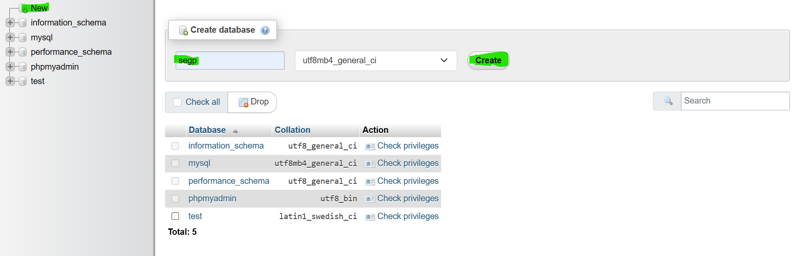

# COMP-2019-GroupG

A repository containing code and development of web appilication for a Seaturtle Conservation Organization. A project for a Software Engineering Module in University of Nottingham Malaysia.

GitHub Repository Link: https://github.com/Rezmana/COMP-2019-GroupG.git

## Setup Instructions

All of the following instructions have been done through VS Code.

First install an up-to-date version of PHP, from the website https://www.php.net/downloads. Follow the installation process and save it in a memorable file.

Next install Node.js version 20.12.2 from this website https://nodejs.org/en/download. This is required to run our React website. It will give you an option to install additional tools, accept it. No other pages need to be adjusted. Follow the instructions for the download in the cmd.

Afterwards, install XAMPP from https://sourceforge.net/projects/xampp/. This is used to localhost our database and Laravel backend. If you already have a localhost, this can also be used but we will not be responsible for issues if a different app is used compared to what we used.

Finally, install Composer from https://getcomposer.org/download/. This is used to update the packages and ensure that all necessary libraries are included in the Laravel. This website may look extremely unreliable but you can be assured this is the correct source.

Unpack the Zip file with our code contained in it. Open VS Code and open the "COMP-2019-GroupG-main" folder.
Open a terminal in VS Code and run 
```
cd Prototype2/SEGP-Website
```
After this run 
```
npm install
```
Next, go to your PHP install, and locate the file "php.ini". This may also just be named "php" with the type being "Configuration Settings". Below is a list of commands that you must uncomment. To do so you simply remove the ';' from the beginning of the line.

- extension=fileinfo
- extension=gd
- extension=zip
- extension=pdo_mysql

The other extensions that should already be uncommented, but are worth checking are:

- extension=mbstring
- extension=curl
- extension=openssl

Open a new terminal in VS Code and run the command 
```
cd Prototype2/laravel-api
```
 Now run
```
composer update
``` 
There should not be, but if this gives an error requiring any more extensions to be enabled, go back to the php.ini file and uncomment these as well before running it again.

Now open XAMPP through your OS and select "Start" for "Apache" and "MySQL". Then select the "Admin" option for "MySQL". This should redirect you to the website "http://localhost/phpmyadmin/" You should select the "New" option on the left hand side of the screen and create a database called "segp". This is shown in the image below. From there move to the "Import" option and find the extracted zip of our code. Inside "COMP-2019-GroupG-main" there should be a file called "TurtleDatabase.sql" this should be selected and then you should select "Import" at the bottom of the page. This should migrate our database to your localhost.



Return to the second terminal in VS Code which is in the file  **"laravel-api"**. Now run the command terminal enter these commands
```
php artisan key:generate 
php artisan serve
```
After entering the command it will run the program

Finally, return to the first terminal in the **"SEGP-Website"** folder and run 
```
npm run dev
``` 
This should return a URL that can be clicked on and will send you to the main page of our website. All the data for the graphs, as well as the mapping data should be shown from the database and all login functionality should be working.

To access our admin dashboard functionality, the username **“admin”** and password **“admin”** can be used.

This has been tested on an x64 Windows 11 System. All installs can be the most up-to-date version except for the Node.js whereby a specific version is specified above.
